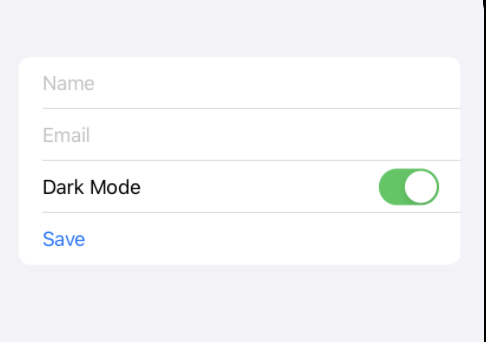
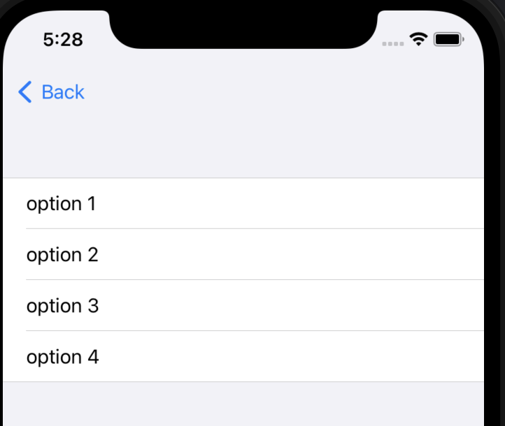
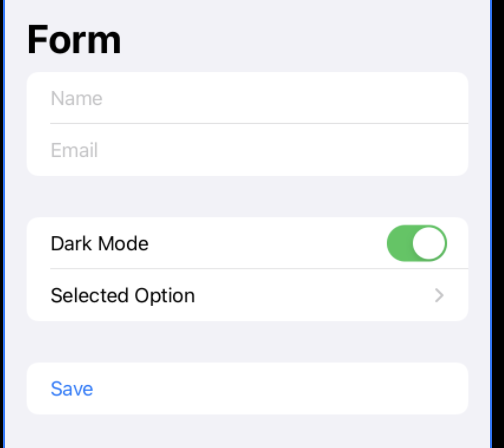
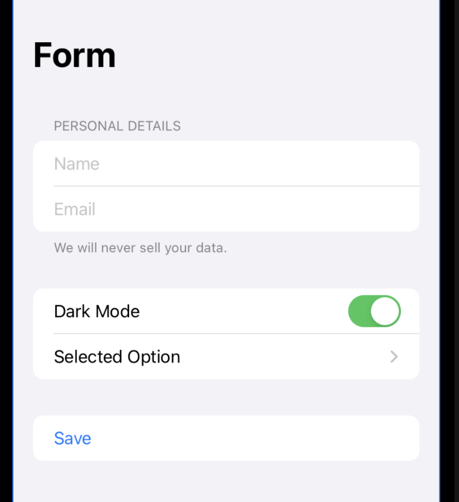

#  Forms in SwiftUI 

From the CodeWithChris Design course module 2 lesson 7 at https://learn.codewithchris.com/courses/take/design/lessons/26070229-lesson-7-forms

Shows how to make a basic form in iOS:
```
struct ContentView: View {
    
    @State var name = ""
    @State var email = ""
    @State var darkMode = true
    
    @State var selectedOption = ""
    var options = ["option 1", "option 2", "option 3", "option 4"]
    
    var body: some View {
        Form {
            TextField("Name", text: $name)
            TextField("Email", text: $email)
            
            Toggle("Dark Mode", isOn: $darkMode)
            
            Button("Save") {
                
            }
        }
    }
}
```



NavigationView is necessary, if you want to use a dropdown picker with a subview:
```
NavigationView {
    Form { ...            }
}
```



Use Sections to separate different parts of the form:
```
Section {
    TextField("Name", text: $name)
    TextField("Email", text: $email)
}
```


Each form section can have its own header and footer:
```
Section {
    TextField("Name", text: $name)
    TextField("Email", text: $email)
} header: {
    Text("Personal Details")
} footer: {
    Text("We will never sell your data.")
}
``` 

